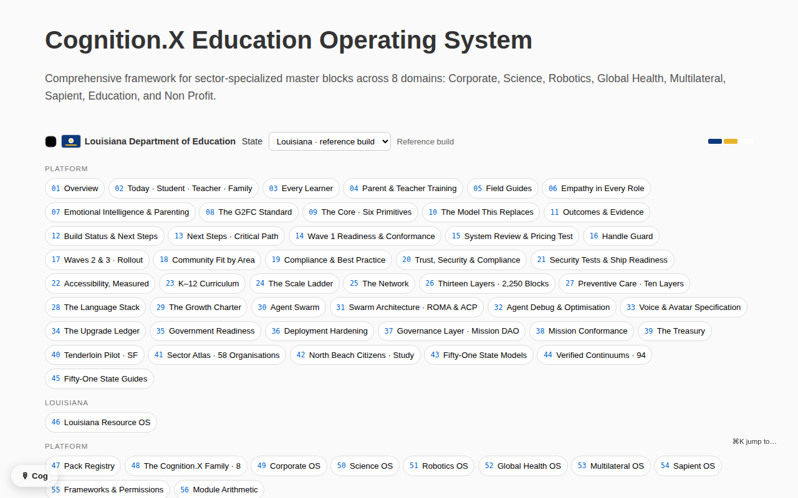

# Education OS App

A single-file, offline-capable HTML application:
[`apps/education-os/index.html`](https://github.com/AGIFutureFoundation/Cognition.X/blob/main/apps/education-os/index.html)
(~8 MB — download and open locally; no server, no network).

## What's inside

- **Governance & pillars** — the five-pillar model, conformance levels,
  and how a learning day runs
- **Implementation plans** — four waves across sixty-four parishes, eight
  regional Trade Halls, eight narrative worlds
- **Five pathways, one credential ledger** — graduation redesigned but
  compliant
- **Mission simulator** — adaptive missions with difficulty bands, tiers
  and hint tracking
- **Master-block library** — the app's embedded block data (by internal
  iteration v227 it includes rounds beyond the CSV export; reconciliation
  is roadmap Phase 2)

## Build lineage

| Repo version | Build | Notes |
|---|---|---|
| v0.2.0 (current) | `index.html` ("gov") | Internal iteration v227: Sector Specialization, +120 master blocks; Google Fonts dependency removed — fully offline |
| v0.1.0 | `versions/v0.1.0-education-os.html` | Earlier build; fetches Inter from Google Fonts |

## On the pipeline (v0.19.0)

`index.html` is now **built**: the hand-grown "gov" build lives on as
`template.html` (shell + legacy content), and
`tools/build_education_os.py` appends a canonical overlay sourcing
`DATA.sectorBlocks` from `data/blocks.csv` — dataset edits flow into
the app, and the overlay cures the template's accumulated duplicate
inflation (11,520 raw rows → 5,200 canonical). Never edit `index.html`
directly.

## Constraint that is a feature

The app must remain deployable as **one file on a USB stick**. Roadmap
Phase 2 introduces a build pipeline (dataset injected from
`data/blocks.csv`) but the shipped artifact stays single-file and
offline-first for low-connectivity deployments.

## Fixed 2026-09-22

The built app threw two errors on load and rendered almost nothing. It
now loads with **zero page errors**: 149 navigation buttons across its
groups, the state picker filled from `DATA.states`, and 5,200 canonical
sector blocks injected from `data/blocks.csv`.

*The Education OS app after the repair.*

Three faults, all in `apps/education-os/template.html`:

1. **A fragment of an older build's data sat in the body outside any
   `<script>`**, so `var DATA = { sectorTax: ... }` rendered as visible
   text on the page. It could not simply be wrapped — the real app
   declares its own `const DATA = {}` further down and a second
   declaration would have collided — so it was deleted.
2. **The body was the older, simpler build's shell** (`#stats`,
   `#blocks`), whose script is gone and which nothing filled, while the
   real script addressed `#nav`, `#views`, `#toast`, `#stateSel`,
   `#stateflag` and `#crumb` — none of which existed. `buildNav()`,
   `buildState()` and `route()` each threw in turn. The shell now carries
   exactly those six mounts; every other element the script addresses is
   produced by a renderer's own markup, and `view(id)` appends each
   section into `#views` on demand.
3. **The doctype was declared twice.**

`tools/build_education_os.py` now refuses to write a page missing any of
the six mounts, carrying a duplicate doctype, or carrying a bare
`var DATA = {` outside a script.

> Screenshot taken from the running app on 2026-09-22 at 1280x800.
